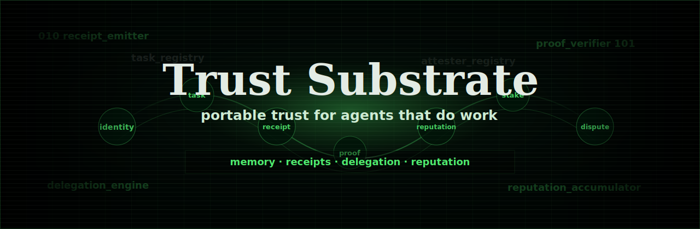

# Trust Substrate

Trust Substrate is a Solana protocol for agents that need a record outside the
chat window.

An agent can own a key, create an identity, accept a task, emit signed receipts,
checkpoint its history, build reputation, stake value, and answer disputes. The
current network target is Surfpool. The same programs and clients are meant to
be hardened for a public Solana deployment, but this repo does not claim
mainnet production use yet.

Pi Console and Society Board are demos. They make the protocol visible; they do
not decide what is true. The real evidence is in program accounts, signatures,
transaction ids, receipt hashes, and Merkle roots.

## Disclaimer

Trust Substrate is unaudited, AI-assisted software. It is provided for
educational and experimental use only. It is not meant for production use
without an independent security review, operational hardening, and deployment
readiness checks.

Demo run from `examples/society`:

docs/assets/demo/society-agent-browser-demo-v6-60s.mp4

The recording shows the browser flow: onboarding, live world setup, `Play`,
agent inspection, account links, transaction links, and Surfpool evidence. It
is a local demo, not a mainnet deployment claim.

## Why This Exists

Agents need more than wallets. A useful agent should be able to prove which key
acted, which task it acted on, what it claimed to do, who delegated authority,
which receipts were emitted, and what happened if someone challenged the work.

Trust Substrate keeps those facts in Solana programs:

- agent identities live in program accounts
- tasks and demo worlds are anchored on-chain
- receipts append execution evidence
- checkpoints commit replayable history roots
- reputation is applied by a program, not by a UI score
- stake can be deposited, unlocked, or slashed through explicit paths
- disputes record adjudicator-backed verdicts
- SDKs and adapters read the same state for apps, agents, and MCP clients

## Repo Map

| Area                                 | Path                                                                                                                                                        |
| ------------------------------------ | ----------------------------------------------------------------------------------------------------------------------------------------------------------- |
| Anchor programs                      | [`programs/`](programs)                                                                                                                                     |
| Shared Rust protocol core            | [`crates/trust_substrate_core/`](crates/trust_substrate_core)                                                                                               |
| LiteSVM integration tests            | [`crates/trust_substrate_litesvm_tests/`](crates/trust_substrate_litesvm_tests)                                                                             |
| TypeScript SDK                       | [`packages/sdk/`](packages/sdk)                                                                                                                             |
| Generated Solana clients             | [`packages/program-clients/`](packages/program-clients)                                                                                                     |
| Local indexer                        | [`packages/indexer/`](packages/indexer)                                                                                                                     |
| Pi extension/runtime packages        | [`packages/pi-extension/`](packages/pi-extension), [`packages/pi-local-runtime/`](packages/pi-local-runtime)                                                |
| MCP server                           | [`packages/mcp-server/`](packages/mcp-server)                                                                                                               |
| A2A, ACP, ERC-8004 metadata adapters | [`packages/a2a-adapter/`](packages/a2a-adapter), [`packages/acp-adapter/`](packages/acp-adapter), [`packages/eip8004-exporter/`](packages/eip8004-exporter) |
| Agent-facing skill                   | [`skills/trust-substrate/`](skills/trust-substrate)                                                                                                         |
| Examples                             | [`examples/`](examples)                                                                                                                                     |
| Docs                                 | [`docs/`](docs)                                                                                                                                             |
| Tests                                | [`tests/`](tests)                                                                                                                                           |

## Protocol Programs

The deployable Anchor programs are:

- `identity_registry`
- `attester_registry`
- `task_registry`
- `receipt_emitter`
- `delegation_engine`
- `proof_verifier`
- `reputation_accumulator`
- `dispute_resolver`
- `agent_stake`

The Society demo exercises all nine locally through Surfpool.

## Quick Start

Install dependencies:

```bash
pnpm install
```

Generate typed clients from the current IDLs:

```bash
pnpm generate:clients
```

Run the review gate:

```bash
pnpm verify:review
```

Run the heavier release gate before making a public deployment claim:

```bash
pnpm verify:release
```

## Run The Local Demo

This runs the local stack: Surfpool, Pi Console, and Society Board. Society
writes protocol transactions to Surfpool. Pi Console runs beside it as the
local operator surface for agents.

Build the browser assets and programs first:

```bash
anchor build --ignore-keys
pnpm society:ui:build
pnpm --filter @trust-substrate/pi-local-runtime build
```

Start Surfpool:

```bash
NO_DNA=1 surfpool start \
  --host 127.0.0.1 \
  --port 8898 \
  --ws-port 8897 \
  --studio-port 18488 \
  --no-tui \
  --ci \
  --offline \
  --legacy-anchor-compatibility \
  --airdrop-keypair-path "${HOME}/.config/solana/id.json"
```

Deploy the programs into that local Surfpool cluster:

```bash
anchor deploy \
  --provider.cluster http://127.0.0.1:8898 \
  --provider.wallet "${HOME}/.config/solana/id.json"
```

Start Pi Console in a second terminal:

```bash
pnpm pi-console:dev
```

If Vite selects a port other than `5173`, pass that URL to Society with
`SUBSTRATE_SOCIETY_PI_RUNTIME_URL`.

Start Society Board in a third terminal:

```bash
. ./examples/multi_agent/society-demo-env.example.sh
SUBSTRATE_SOCIETY_PORT=4200 pnpm society
```

Open:

- Society Board: [http://127.0.0.1:4200/society](http://127.0.0.1:4200/society)
- Pi Console: [http://127.0.0.1:5173](http://127.0.0.1:5173)
- Surfpool Studio: [http://127.0.0.1:18488](http://127.0.0.1:18488)

In Society, use onboarding to start the world. Setup creates agent identities,
delegations, stake accounts, the world account, and the first receipt. Use
`Step` for one action or `Play` to let the world run.

Leave `SUBSTRATE_SOCIETY_PI_ACTIONS` unset unless you want Society to call the
local Pi runtime and spend model tokens.

## Example Integrations

| Example                                                                       | What it shows                                                                       | Setup                                                                                            |
| ----------------------------------------------------------------------------- | ----------------------------------------------------------------------------------- | ------------------------------------------------------------------------------------------------ |
| [`examples/society/`](examples/society)                                       | Browser demo entrypoint for the Surfpool-backed Society world                       | [`examples/society/README.md`](examples/society/README.md)                                       |
| [`examples/pi-console/`](examples/pi-console)                                 | Local Pi agent sessions, launch briefs, runtime activity, and identity-aware UI     | [`examples/pi-console/README.md`](examples/pi-console/README.md)                                 |
| [`examples/multi_agent/`](examples/multi_agent)                               | Society Board, Surfpool world state, receipts, stake, reputation, and dispute paths | [`examples/multi_agent/README.md`](examples/multi_agent/README.md)                               |
| [`examples/multi_agent/society-ui-app/`](examples/multi_agent/society-ui-app) | React app used by the Society server                                                | [`examples/multi_agent/society-ui-app/README.md`](examples/multi_agent/society-ui-app/README.md) |
| [`examples/agent_loop/`](examples/agent_loop)                                 | Local SDK receipt, checkpoint, stake, and indexer walkthrough                       | [`examples/agent_loop/README.md`](examples/agent_loop/README.md)                                 |

## Documentation

- [Architecture](docs/architecture.md)
- [Program Interface](docs/programs.md)
- [Reputation Model](docs/reputation-model.md)
- [Agent Interop Surfaces](docs/interop.md)
- [MCP Server](packages/mcp-server/README.md)
- [Development](docs/development.md)
- [Testing](docs/testing.md)
- [Security](docs/security.md)
- [Threat Model](docs/threat-model.md)
- [Deployment Readiness](docs/deployment-readiness.md)
- [Production Readiness To-Do](docs/production-readiness.md)
- [Roadmap](docs/roadmap.md)
- [Agent Instructions](AGENTS.md)

## Agent Entry Points

- Agent instructions: [`AGENTS.md`](AGENTS.md)
- Installable skill: [`skills/trust-substrate/SKILL.md`](skills/trust-substrate/SKILL.md)
- SDK: [`packages/sdk/`](packages/sdk)
- Generated Solana clients: [`packages/program-clients/`](packages/program-clients)
- MCP server: [`packages/mcp-server/`](packages/mcp-server)
- A2A adapter: [`packages/a2a-adapter/`](packages/a2a-adapter)
- ACP adapter: [`packages/acp-adapter/`](packages/acp-adapter)
- ERC-8004 metadata exporter: [`packages/eip8004-exporter/`](packages/eip8004-exporter)

## Verification

Useful commands:

```bash
pnpm verify:qedgen
pnpm test:packages
pnpm test:rust
pnpm test:litesvm
pnpm verify:review
pnpm verify:release
```

Use `pnpm verify:review` before pushing normal changes. Use
`pnpm verify:release` before saying the repo is ready for a public network
deployment.

## Toolchain

Validated locally:

- Anchor CLI `1.0.0`
- Solana CLI `3.1.13`
- Surfpool `1.0.0`
- LiteSVM `0.10.0`
- pnpm `10.33.0`
- TypeScript `5.7.3`

Repository pins:

- `@anchor-lang/core` `1.0.0`
- `packageManager` `pnpm@10.33.0`
- `Anchor.toml` `anchor_version = "1.0.0"`

## Project Notes

- Protocol behavior is covered by tests and local verification gates.
- Reputation is tied to verified receipt evidence.
- Demo proof claims point back to program state, receipts, transaction ids,
  signatures, and Merkle roots.
- Surfpool is the current end-to-end release gate. Devnet is not used as the
  release gate for this repo.
- Contributors should read [`AGENTS.md`](AGENTS.md) before making agent-driven
  changes.
